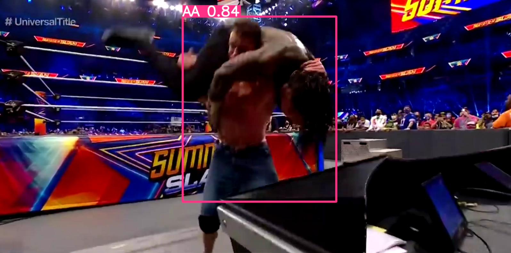
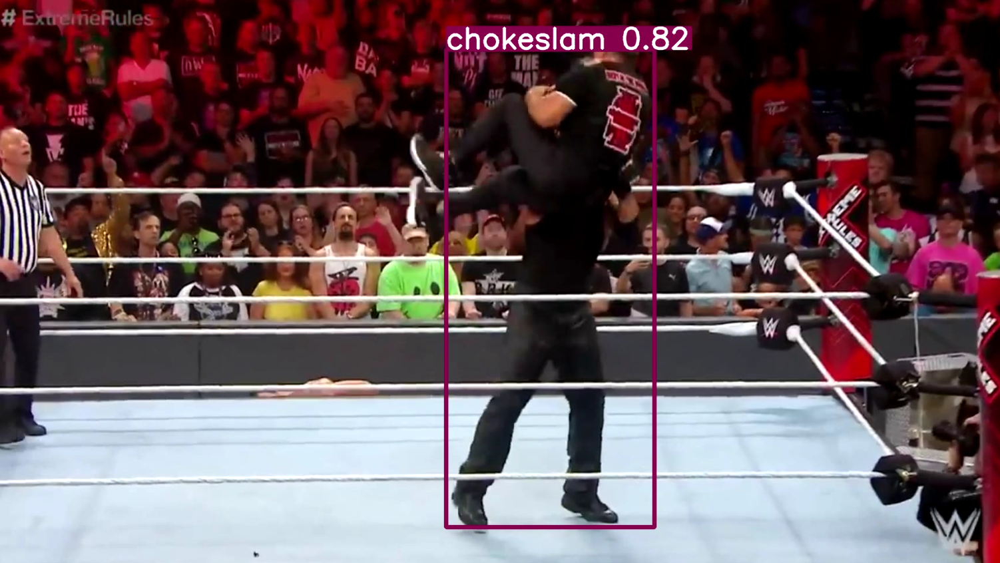

# Wrestling Move Detection using YOLOv5

This repository contains code for detecting wrestling moves from a video. The model is trained to recognize two specific moves: 
- Attitude Adjustment 
- Chokeslam

## Training

The video detection model is trained using YOLOv5. Annotations were created using RoboFlow. The model is designed to detect both the start and end of the moves.

## Usage

A Streamlit application has been developed to provide a user-friendly interface. Users can upload a video file, set a threshold, and specify a confidence score.

### Instructions:

1. Upload a video file.
2. Set the threshold and confidence score.
3. View the detected timestamps for the start and end of the moves.


## Getting Started

To get started, follow these steps:

1. Clone this repository.
2. Install the required dependencies.
3. ```streamlit run move_detector.py```


## Results

The results display the timestamps indicating when each move begins and ends in the uploaded video.

- Some of the results obtained from the model:
    
    